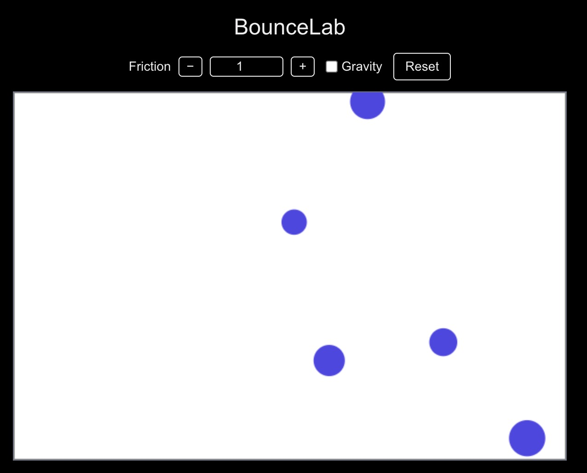

# BounceLab

A browser-based 2D physics playground where balls bounce inside a box with real-time adjustable parameters such as friction and gravity.

Built with Next.js and designed to run primarily on the client side, making it fast and lightweight.

# ✨ Features

- Multiple balls bouncing inside a box
- Ball-to-ball collision detection
- Wall collision with reflection
- Gravity ON / OFF toggle
- Adjustable friction coefficient (step buttons)
- Click to add new balls
- Reset button to return to initial state
- Dark mode support

# 🚀 Getting Started
1. Install dependencies
```
npm install
```

2. Run development server
```
npm run dev
```

Open:

http://localhost:3000

# 🎮 How to Use

Click canvas → Add a new ball
Friction → Use + / - buttons or number input
Gravity → Toggle checkbox
Reset → Restore initial balls

# 📸 Screenshot



# 🧠 Future Ideas

- Restitution (bounciness) slider
- Ball count stepper
- Preset buttons
- FPS counter
- Sound effects
